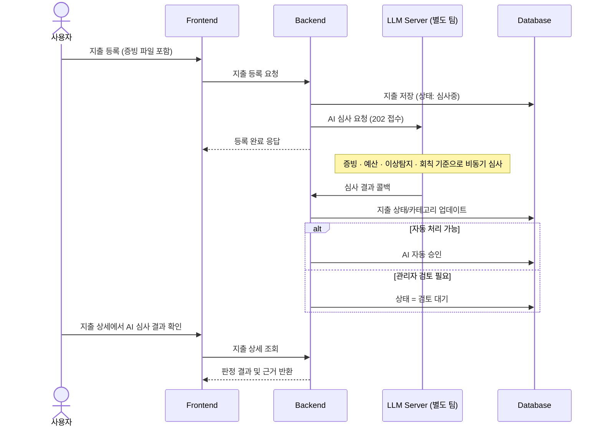

# 예산관리시스템

모임의 회비와 예산을 체계적으로 관리하고, 지출 내역을 AI로 심사하여 승인 과정을 간소화하는 예산 관리 서비스입니다.

모임별로 예산과 지출 내역을 관리할 수 있으며, 회칙과 승인 정책을 기준으로 지출을 검토하고 대시보드와 리포트를 통해 모임의 예산 사용 현황을 확인할 수 있습니다.

> 이 저장소는 [BudgetOps-Agent/unName](https://github.com/BudgetOps-Agent/unName)을 포크한 팀 프로젝트(3인)를 개인 포트폴리오 목적으로 가져온 것입니다. 본인은 백엔드 개발과 AWS 배포를 담당했습니다. AI 지출 심사를 처리하는 LLM 서버는 별도 팀이 별도 저장소에서 개발했습니다.

## 주요 기능

### 회원 관리

- 회원가입 및 로그인
- JWT 기반 인증
- 아이디 찾기
- 비밀번호 찾기 및 재설정
- 사용자 정보 조회
- 로그아웃 및 토큰 재발급

### 모임 관리

- 모임 생성
- 내 모임 목록 조회
- 모임 초대 및 초대 수락/거절
- 모임 멤버 조회
- 멤버 권한 변경
- 관리자 권한 위임
- 멤버 추방
- 모임 탈퇴

### 지출 관리

- 지출 등록
- 지출 목록 조회
- 지출 상세 조회
- 지출 수정 및 삭제
- 지출 상태별 필터링
- 지출 처리 이력 조회
- 영수증 파일 등록

### 예산 관리

- 전체 예산 조회
- 예산 추가 및 수정
- 예산 사용 금액 확인
- 예산 사용률 확인
- 잔여 예산 확인
- 카테고리별 지출 분석
- 월별 지출 통계

### AI 기반 지출 심사

지출 등록 후 AI가 회칙과 예산, 증빙 등의 기준을 바탕으로 지출을 심사합니다.

- AI 지출 심사
- 지출 카테고리 자동 분류
- 증빙 적합성 검토
- 예산 적합성 검토
- 이상 지출 탐지
- 회칙 적합성 검토
- AI 자동 승인
- 관리자 검토 요청
- 관리자 승인 및 반려
- 심사 결과 및 판정 근거 확인

AI가 자동으로 처리하기 어려운 지출은 관리자 검토 대상으로 전환하여 최종 승인 여부를 직접 판단할 수 있습니다.

### 회칙 및 정책 관리

- 회칙 목록 조회
- 회칙 등록
- 회칙 직접 입력
- PDF / DOCX 파일 업로드
- 회칙 수정 및 삭제
- 회칙 다운로드
- AI 기반 회칙 초안 추천

회칙은 지출 심사 과정에서 AI가 지출의 적합성을 판단하는 기준으로 활용됩니다.

### 대시보드

모임의 예산과 지출 현황을 한눈에 확인할 수 있습니다.

- 전체 예산
- 사용 예산
- 남은 예산
- 예산 사용률
- 월별 지출 현황
- 최근 지출 내역
- 승인 대기 지출
- AI 기반 지출 요약

### 리포트

관리자와 회계 담당자는 승인된 지출을 기준으로 모임의 전체 지출 현황을 확인할 수 있습니다.

- 총 지출 금액
- 예산 사용률
- 남은 예산
- 지출 명세 조회
- 페이지네이션
- CSV 다운로드

## Tech Stack

### Front-End

- Next.js
- React
- TypeScript
- React Query
- Axios
- Zustand
- CSS / CSS Module

### Back-End

- Spring Boot
- Java
- JPA
- Spring Security

### Database

- MySQL

### Cache

- Redis

### AI

- LLM Server

### Infra

- AWS EC2
- Docker / Docker Compose
- Nginx
- GoDaddy (DNS)
- Let's Encrypt (SSL)
- AWS S3 (파일 저장)
- GitHub Actions (CI/CD)

## System Architecture

```text
                    ┌─────────────────┐
                    │     Browser     │
                    └────────┬────────┘
                             │
                             ▼
                    ┌─────────────────┐
                    │    Next.js      │
                    │    Front-End    │
                    └────────┬────────┘
                             │
                             │ REST API
                             ▼
                    ┌─────────────────┐
                    │   Spring Boot   │
                    │     Backend     │
                    └───────┬─┬───────┘
                            │ │
                 ┌──────────┘ └──────────┐
                 ▼                       ▼
        ┌─────────────────┐     ┌─────────────────┐
        │      MySQL      │     │   LLM Server    │
        │    Database     │     │   AI 심사/분석    │
        └─────────────────┘     └─────────────────┘
                 │
                 ▼
        ┌─────────────────┐
        │      Redis      │
        │ Cache / Session │
        └─────────────────┘
```

## 전체 흐름도

지출 등록부터 AI 심사, 승인까지 이어지는 핵심 플로우입니다.



## 주요 화면

### 대시보드

모임의 전체 예산과 지출 현황을 확인할 수 있습니다.

- 예산 사용 현황
- 월별 지출 차트
- 최근 지출
- 승인 대기 지출
- AI 지출 요약

### 지출 내역

등록된 지출을 조회하고 상태별로 관리할 수 있습니다.

```text
전체 | 대기 | 승인 | 반려
```

AI가 자동 처리한 지출과 관리자 검토가 필요한 지출을 상태와 처리 주체를 통해 구분할 수 있습니다.

### 지출 상세

지출 금액, 내용, 증빙 등의 정보를 확인하고 AI 심사 결과를 함께 확인할 수 있습니다.

AI 심사는 다음 항목으로 구분됩니다.

```text
증빙
예산
이상탐지
회칙
```

각 항목별 판정 결과와 근거를 확인할 수 있으며, 관리자 검토가 필요한 지출은 승인 또는 반려할 수 있습니다.

### 예산 관리

전체 예산과 사용된 금액, 잔여 예산 및 사용률을 확인할 수 있습니다.

또한 승인된 지출을 기준으로 카테고리별 지출 비중을 확인하고 AI가 생성한 예산 운용 분석을 확인할 수 있습니다.

### 회칙 관리

회칙을 직접 작성하거나 파일로 등록할 수 있습니다.

```text
파일 업로드
     │
     ├── PDF
     └── DOCX

직접 입력
     │
     └── 회칙 내용 작성

AI 추천
     │
     └── 기존 내용을 기반으로 회칙 초안 생성
```

### 멤버 관리

모임 구성원을 관리하고 역할에 따라 권한을 변경할 수 있습니다.

- 멤버 목록 조회
- 멤버 초대
- 초대 대기 목록
- 권한 변경
- 관리자 권한 위임
- 멤버 추방

## 지출 처리 Flow

```text
지출 등록
    │
    ▼
지출 정보 저장
    │
    ▼
AI 지출 심사 요청
    │
    ├───────────────┐
    ▼               ▼
자동 처리 가능       관리자 검토 필요
    │               │
    ▼               ▼
AI 자동 승인       관리자 승인/반려
    │               │
    └───────┬───────┘
            ▼
        지출 상태 반영
            │
            ▼
      예산 사용 현황 반영
```

## 예산 관리 Flow

```text
전체 예산 설정
      │
      ▼
지출 등록
      │
      ▼
AI 심사
      │
      ▼
지출 승인
      │
      ▼
승인된 지출 집계
      │
      ├── 사용 예산
      ├── 예산 사용률
      ├── 잔여 예산
      └── 카테고리별 지출
```

## 인증 처리

JWT 기반 인증을 사용합니다.

```text
로그인
  │
  ▼
Access Token / Refresh Token 발급
  │
  ▼
인증 정보 저장
  │
  ▼
API 요청
  │
  ▼
인증 토큰 검증
  │
  ├── 정상 → API 요청 처리
  │
  └── 만료 → Token 재발급
```

## API

백엔드와 REST API 방식으로 통신합니다.

### User

| Method | Endpoint | Description |
|---|---|---|
| POST | `/api/user/signup` | 회원가입 |
| POST | `/api/user/login` | 로그인 |
| GET | `/api/user/verify` | 토큰 인증 |
| POST | `/api/user/reissue` | 토큰 재발급 |
| POST | `/api/user/logout` | 로그아웃 |
| GET | `/api/user/me` | 사용자 정보 조회 |

### Team

| Method | Endpoint | Description |
|---|---|---|
| POST | `/api/teams` | 모임 생성 |
| GET | `/api/teams/my` | 내 모임 목록 조회 |
| POST | `/api/teams/{teamId}/invite` | 멤버 초대 |
| GET | `/api/teams/{teamId}/members` | 멤버 목록 조회 |
| DELETE | `/api/teams/{teamId}/leave` | 모임 탈퇴 |

### Expense

| Method | Endpoint | Description |
|---|---|---|
| GET | `/api/teams/{teamId}/expenses` | 지출 목록 조회 |
| POST | `/api/teams/{teamId}/expenses` | 지출 등록 |
| GET | `/api/expenses/{expenseId}` | 지출 상세 조회 |
| PUT | `/api/expenses/{expenseId}` | 지출 수정 |
| DELETE | `/api/expenses/{expenseId}` | 지출 삭제 |
| POST | `/api/expenses/{expenseId}/approve` | 지출 승인 |
| POST | `/api/expenses/{expenseId}/reject` | 지출 반려 |
| GET | `/api/expenses/{expenseId}/logs` | 지출 처리 이력 |

### Budget

| Method | Endpoint | Description |
|---|---|---|
| GET | `/api/teams/{teamId}/budget` | 예산 조회 |
| PATCH | `/api/teams/{teamId}/budget` | 예산 수정 |

### AI

| Method | Endpoint | Description |
|---|---|---|
| POST | `/api/expenses/{expenseId}/ai-review` | AI 지출 심사 |
| GET | `/api/expenses/{expenseId}/review-result` | AI 심사 결과 조회 |
| GET | `/api/teams/{teamId}/dashboard/ai-summary` | AI 대시보드 요약 |
| POST | `/api/policies/recommend` | AI 회칙 추천 |

### Policy

| Method | Endpoint | Description |
|---|---|---|
| GET | `/api/teams/{teamId}/policies` | 회칙 목록 조회 |
| POST | `/api/teams/{teamId}/policies` | 회칙 등록 |
| GET | `/api/policies/{policyId}` | 회칙 상세 조회 |
| PUT | `/api/policies/{policyId}` | 회칙 수정 |
| DELETE | `/api/policies/{policyId}` | 회칙 삭제 |
| GET | `/api/policies/{policyId}/download` | 회칙 다운로드 |

## Project Structure

```text
frontend
├── public
│
├── src
│   ├── app
│   │
│   ├── features
│   │   ├── auth
│   │   ├── teams
│   │   ├── expenses
│   │   ├── budget
│   │   ├── policies
│   │   ├── members
│   │   ├── dashboard
│   │   └── report
│   │
│   ├── shared
│   │   ├── components
│   │   ├── hooks
│   │   ├── utils
│   │   └── types
│   │
│   └── ...
│
├── package.json
├── next.config.ts
├── tsconfig.json
└── README.md
```

## 실행 방법

### 1. 프로젝트 설치

```bash
npm install
```

### 2. 환경 변수 설정

`.env.local` 파일을 생성하고 API 서버 주소를 설정합니다.

```env
NEXT_PUBLIC_API_URL=http://localhost:8080
```

프로젝트 환경에 맞게 API 서버 주소를 변경합니다.

### 3. 개발 서버 실행

```bash
npm run dev
```

브라우저에서 다음 주소로 접속합니다.

```text
http://localhost:3000
```

### 4. 빌드

```bash
npm run build
```

### 5. 운영 서버 실행

```bash
npm run start
```

### 6. 코드 검사

```bash
npm run lint
```

## 배포 주소

- 프론트엔드: https://budget-ops.site
- 백엔드 API: https://api.budget-ops.site

## Back-End 실행 방법

### 1. 로컬 실행 (Docker 없이)

```bash
cd backend
./gradlew bootRun
```

로컬 MySQL/Redis 없이도 기본 설정으로 기동됩니다. 실제 DB 연동 시 `application.properties`의 데이터소스 값을 로컬 환경에 맞게 설정합니다.

### 2. 배포 환경 실행 (Docker Compose)

```bash
cd deploy
cp .env.example .env   # 값 채우기 (DB 비밀번호, JWT 시크릿, LLM 토큰 등)
docker compose up -d --build
```

- `nginx` → `backend`(Spring Boot, 8080) → `mysql` / `redis` 순서로 컨테이너가 뜹니다.
- DB는 최초 실행 시 비어 있는 상태로 시작하며, Hibernate(`ddl-auto=update`)가 엔티티 기준으로 테이블을 자동 생성합니다.
- 영수증·회칙 파일은 `AWS_S3_BUCKET` 환경변수가 설정된 경우 S3에, 없으면 로컬 디스크에 저장됩니다(로컬 개발 시 AWS 키 불필요).

### 3. 환경변수 (`deploy/.env`)

| 변수 | 설명 |
|---|---|
| `DB_ROOT_PASSWORD`, `DB_NAME`, `DB_USERNAME`, `DB_PASSWORD` | MySQL 접속 정보 |
| `JWT_SECRET` | JWT 서명 키 (32자 이상) |
| `FILE_BASE_URL` | 파일 URL에 쓸 배포 도메인 |
| `LLM_BASE_URL`, `LLM_SERVICE_TOKEN` | 우리 → LLM 서버 호출용 |
| `AGENT_SERVICE_TOKEN` | LLM → 우리 서버 호출(콜백·내부 API) 검증용 |
| `AWS_S3_BUCKET`, `AWS_REGION` | 파일 저장용 S3 버킷 (미설정 시 로컬 디스크 모드) |
| `AWS_ACCESS_KEY_ID`, `AWS_SECRET_ACCESS_KEY` | EC2에 IAM 역할을 붙인 경우 비워둬도 SDK가 자동 인증 |

### 4. CI/CD

`main` 브랜치에 push되면 GitHub Actions(`.github/workflows/deploy-aws.yml`)가 EC2에 SSH로 접속해 자동으로 재배포합니다. `dev`는 기능 통합 브랜치로, 배포에 영향을 주지 않습니다.

### 5. 테스트

```bash
cd backend
./gradlew test          # 슬라이스·통합 테스트
./gradlew clean build   # 빌드 + 전체 테스트
```

테스트는 인메모리 H2로 동작하도록 별도 프로파일(`src/test/resources/application-test.properties`)을 두어 로컬 MySQL/Redis 없이 실행됩니다. 대표 테스트로 지출 승인/반려의 낙관적 락 동시성 검증(`ExpenseConcurrencyTest`)이 포함되어 있습니다.

## 상태 관리

서버 상태와 클라이언트 상태를 분리하여 관리합니다.

### React Query

API 요청 및 서버 상태 관리를 담당합니다.

```text
Component
    │
    ▼
React Query Hook
    │
    ▼
API Function
    │
    ▼
Backend API
```

### Zustand

전역적으로 필요한 클라이언트 상태를 관리합니다.

## AI 연동

AI 기능은 별도의 LLM 서버와 API를 통해 연동됩니다.

주요 AI 기능은 다음과 같습니다.

- 지출 카테고리 자동 분류
- 회칙 기반 지출 심사
- 예산 적합성 분석
- 이상 지출 탐지
- AI 지출 자동 승인
- 관리자 검토 요청
- 예산 운용 분석
- 회칙 초안 추천

백엔드와 LLM 서버 사이에서는 API 요청 및 응답 형식뿐 아니라 파일 전달 방식, 카테고리 값, 승인 기준 등의 데이터 계약을 맞춰 통합 환경에서 동작하도록 구성했습니다.

## 개발 과정에서 해결한 문제

### API 명세 조율

백엔드와 LLM 서버를 서로 다른 팀에서 개발하면서 지출 카테고리, 회칙 파일, AI 심사 요청 데이터 등의 세부적인 데이터 형식을 조율했습니다.

지출 등록 시 카테고리를 필수로 입력하지 않고 AI 심사 결과를 통해 카테고리를 보완하는 방식으로 변경했습니다.

### 자동승인 기준 통일

자동승인 금액과 관리자 확인 금액을 별도로 관리하면서 발생할 수 있는 정책상의 혼선을 줄이기 위해 `autoApproveLimit`을 중심으로 승인 기준을 통일했습니다.

### 회칙 파일 전달 방식 정리

회칙 파일을 단순 문자열이나 URL로 전달하는 방식 대신 원본 파일의 MIME Type과 파일 데이터를 전달하도록 정리하여 LLM 서버에서 실제 파일 내용을 처리할 수 있도록 했습니다.

### 데이터 정합성 문제

백엔드와 LLM 서버에서 사용하는 카테고리와 상태값이 서로 다르게 정의되지 않도록 API와 DB의 데이터 구조를 함께 확인했습니다.

### 지출 동시 처리 정합성 검증

여러 관리자가 같은 지출을 동시에 승인·반려할 때 두 처리가 모두 반영되는 상황을 막기 위해 `Expense` 엔티티에 `@Version` 기반 낙관적 락을 두었고, 이것이 실제로 동작하는지 검증하는 테스트(`ExpenseConcurrencyTest`)를 추가했습니다. 두 스레드가 각자의 트랜잭션에서 같은 지출을 동시에 처리하면 한쪽만 커밋에 성공하고 다른 쪽은 `ObjectOptimisticLockingFailureException`으로 실패하는 것을 확인합니다. 테스트 스위트는 인메모리 H2로 구성하여 로컬 인프라 없이 `./gradlew build`가 통과하도록 정리했습니다.

### 배포 환경 통합 테스트

개발 환경에서 각각 정상적으로 동작하는 기능만 확인하는 것이 아니라 실제 배포 환경에서 전체 흐름을 연결하여 통합 테스트를 진행했습니다.

```text
Frontend
   ↓
Backend
   ↓
LLM Server
   ↓
Database
```

## What I Learned

이번 프로젝트를 통해 단순히 화면을 구현하는 것뿐 아니라 서비스 전체의 데이터 흐름을 이해하는 것이 중요하다는 것을 경험했습니다.

특히 프론트엔드에서 사용하는 데이터가 백엔드 API와 어떻게 연결되고, DB에 어떤 형태로 저장되는지까지 확인하면서 기능을 구현했습니다.

또한 AI 기능을 실제 서비스에 연결하는 과정에서 API 요청·응답 형식뿐만 아니라 데이터 타입, ENUM 값, 파일 형식, 인증 방식까지 서로 일치해야 정상적인 연동이 가능하다는 점을 경험했습니다.

이를 통해 프론트엔드 기능 구현을 넘어 백엔드 API와 데이터 구조를 함께 고려하며 서비스를 개발하는 경험을 쌓았습니다.
